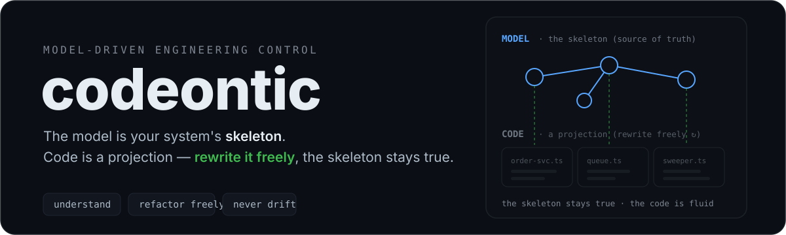
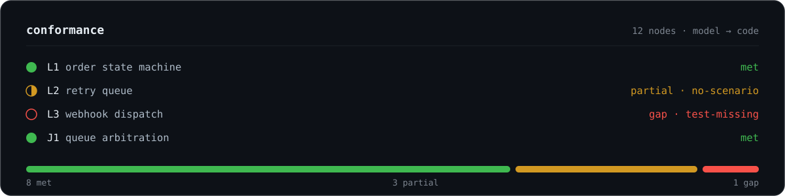
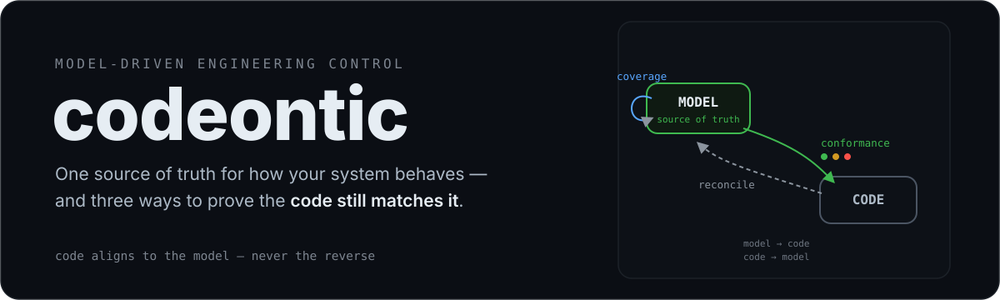
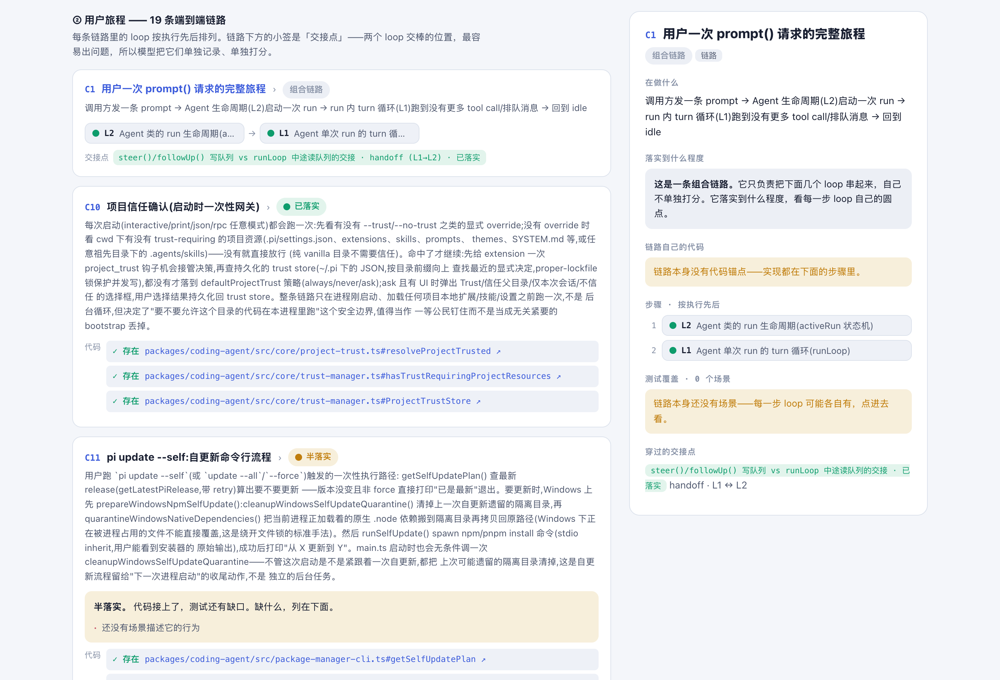
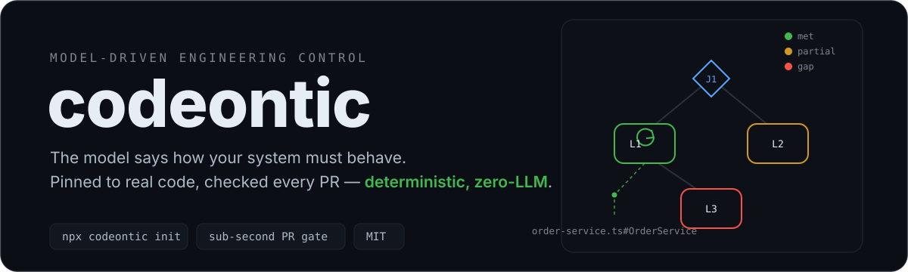

<p align="center">
  
</p>

<p align="center">
  <b>模型是系统的骨架，代码是投影——代码随便改，骨架不失真。</b><br>
  <sub>看得懂 · 敢重构 · 不漂移 &nbsp;·&nbsp; 确定性、零 LLM &nbsp;·&nbsp; <a href="README.md">English</a></sub>
</p>

---

## 这是什么

系统真正的行为，散落在代码各处：队列消费、定时器、重试链、状态机，还有 CLI 跑一遍就结束的执行路径。没有一个地方完整写着"这套系统应该怎么运转"，也没有东西证明它现在还是这么运转的。

codeontic 让你把这件事写下来，存成一份**模型**：用五种固定的节点——loop（循环）、flow（链路）、junction（交接点）、scenario（场景）、debt（旧账）——描述系统应该怎么跑，每一条都绑定到真实的代码符号上。写下来之后，机器每次 PR 替你核对：代码还符不符合模型。

这直接换来三件事：

- **看得懂。** 新人和 agent 读一张图，不用从头逆向整个仓库。
- **敢重构。** 代码怎么改都行，改完跑一遍 `conformance`，它告诉你骨架还在不在。
- **不漂移。** 每个缺口都是代码欠模型的账，每次 PR 都对一次。

**为什么是现在。** agent 开始写码之后，人不再逐行读代码，脑子里那张系统图很快就旧了。可你还是要做判断：这个系统里有哪些会自己运转的循环？逻辑怎么从 A 走到 B？哪里没有测试守着？模型就是用来回答这三个问题的，而且每次 PR 都被重新校对，随时可以信。最终的分工是：**人审模型，agent 写码。**

## 想法从哪来

这套设计受**本体论**启发。本体论是个老办法：用一套固定的概念和关系，把一个领域里"有什么、彼此怎么关联"写成机器能处理的结构。codeontic 的五种节点——loop、flow、junction、scenario、debt——就是一个专门描述"系统行为"的小本体。

只是方向反了过来。传统本体从现实里归纳，现实永远是对的；codeontic 的模型是**规范**：先写下系统应该怎么运转，再让代码来对齐。归纳出来的图只能描述现状，立成规范的模型才能审判现状——下面几节讲的就是怎么审。

## 模型绑定在三个地方

模型不是文档。它在三个地方跟真实世界扣在一起，每一处都由机器核对：

1. 行为绑定到代码符号上：`anchors: path#symbol`；
2. 行为写成 GWT 场景：given / when / then，用业务的话写；
3. 场景指向真实测试：`verified_by`。测试标题是带空格的句子？写 `{file, text}` 就行。

机器核对的是这些东西**存不存在、指的地方对不对**。它不判断"这个测试是否真的测到了场景说的事"——要判断那个就得跑你的代码，而门禁永远不跑你的代码。这条线是故意画的。

<p align="center">
  
</p>

## 跟 code-graph 有什么区别

code-graph 是从代码里算出来的，所以代码永远"没错"——它只能告诉你代码长什么样。codeontic 反过来：模型说了算，代码来对齐。

<p align="center">
  
</p>

- **`reconcile`**——找代码里有、模型没登记的信号（队列、定时器、轮询）。
- **`coverage`**——模型自查：多少节点真的绑到了代码上。
- **`conformance`**——给每个建模行为打分：`met` / `partial` / `gap`，缺什么点名什么。

方向从不反转。所以只有它能说出那句 code-graph 说不出的话：**代码错了。**

## 一个真实的例子

[earendil-works/pi](https://github.com/earendil-works/pi) 是个公开的 agent 工具仓库：10 个 package，约 670 个 TypeScript 源文件。整个仓库建完是这样：

| | |
| --- | --- |
| 模型 | 30 loop · 19 flow · 7 junction · 4 debt · 51 scenario |
| 怎么建的 | 5 个并行 agent 会话，加一次人工合并裁决 |
| 门禁 | `check --strict-anchors` → exit 0，零 warning |
| 覆盖 | 绑定 52 个代码文件；最近 26 次提交里 13 次改到它们（50%） |
| 打分 | 43 met · 7 partial · 2 gap |

<p align="center">
  
</p>

**[直接打开完整交互地图](https://krislavten.github.io/codeontic/examples/pi-overview.html)**——每条链路、每个 loop 都能点开，代码链接指向 pi 在 `666d897` 的真实文件。它是一个自包含的 HTML 单文件，也在仓库里（[`docs/examples/pi-overview.html`](docs/examples/pi-overview.html)），下载后离线可开。由 codeontic 0.10.0 生成。

pi 是个健康、活跃的仓库。这样的账每个大仓都有，区别只是有没有一张图把它摆出来：

- 有三处功能，代码写完了，但生产路径上没有任何人在用。
- 一个包里有四份互相不知道的"查过期就刷新"代码。单看每份都对，放在一起就是一个要不要合并的问题。
- 同一种写法——`setTimeout` 的回调里再挂一个 `setTimeout`——在三个不相干的包里各出现一次：渲染节流、SQLite 租约心跳、WebSocket 保活。只搜 `setInterval`，一个都搜不到。

最后这条解释了为什么值得建全仓：跨包的模式，只建一个子系统永远看不见。方法和全部证据：[Proposal 016](docs/proposals/016-three-layer-adoption-plan.md)。

## 快速开始

```bash
npx codeontic init          # 生成 model 骨架 + agent 指令 + /codeontic 前门
npx codeontic check . --repo-root . --strict-anchors   # 确定性门禁，亚秒出结果
npx codeontic conformance . --repo-root .              # met / partial / gap 成绩单
npx codeontic graph . --repo-root .                    # 整张模型的 HTML，按打分上色
```

`init` 写出 `.codeontic/` 骨架和一套 **agent 指令**：你仓库里的 coding agent 照着它扫代码、起草模型。草稿由你审，没核实的不落库。

### 命令

| 命令 | 做什么 | 挡不挡 PR |
| --- | --- | --- |
| `check` | 确定性门禁：schema、引用完整、图无环、锚点存在、AST 不变量。另有两项一致性检查只报 warning：两个节点绑定同一个符号、正文引用了不存在的 id。`--diff` 只查增量 | **挡**——唯一会挡的 |
| `conformance` | 给每个建模行为打分：met / partial / gap，缺什么点名什么 | 只提醒 |
| `reconcile` | 找代码里有、模型没登记的信号 | 只提醒 |
| `coverage` | 模型自查：多少节点真的绑到了代码 | 只提醒 |
| `backtest` | 最近 N 个改过 `.ts`/`.tsx` 的提交里，多少落在模型绑定的文件上 | 只提醒 |
| `graph` | 整张模型的 HTML，按打分上色 | — |
| `overview` | 交互式系统地图：每条链路、每个 loop 都能点开 | — |
| `snapshot` | 每晚全量扫一遍，出漂移报告 | 永不挡 |
| `impact <id>` | 改这里会牵动什么 | — |
| `mcp` | 起一个 MCP server，agent 按需查模型切片，不用通读 spec | — |

`--strict-anchors` 只把两种"错就是错"的检查升成 error：锚点写法不合法、绑定的**文件**不存在。文件还在、只是里面找不到那个符号——这种永远只是 warning：它靠全文匹配，一次正常重构就可能误伤，老误报的门禁最后会被人关掉。但它没有被扔掉：`conformance` 会用它，锚点失效的节点拿不到 `met`。**门禁宽，成绩单严。**

## coding agent 怎么用它

不用教。`init` 已经把说明书放进了你的仓库：

- **`.claude/skills/codeontic/SKILL.md`**——Claude Code 自动识别成 `/codeontic`，按意图分路：发现建模（小仓单 agent；大仓走 `.codeontic/agent/loop-discovery-parallel.md` 分域并行）、跑门禁、查缺口、出图、查模型。Cursor、Codex 这类能读文件的 agent，读同一份文件照做。
- **`.codeontic/agent/` 三份指令**——发现建模的四遍扫描法、给 PR 模板加声明栏、按你仓库的惯例配 CI。
- **`codeontic mcp`**——起一个 MCP server，agent 按需查模型切片（影响面、场景、证据），不用通读整个模型。

## 模型长什么样

<p align="center">
  
</p>

```yaml
# .codeontic/model/loops/*.yaml —— 一个后台控制循环（示例是虚构的）
- id: L1
  kind: loop
  title: Order 状态机
  boundary: "pending → processing → shipped/cancelled；cancelled 是终态"
  owner: packages/orders
  anchors: ["packages/orders/src/order-service.ts#OrderService"]  # 绑定到真实代码符号
  consumes_queues: ["order:process"]                              # 按名字对账生产和消费
  scenarios: [GWT-A1-001]                                         # GWT 场景，verified_by 指向真实测试
```

完全没有后台循环的仓库——CLI、构建工具、一次性管线——直接给旅程建模：

```yaml
# .codeontic/model/flows/*.yaml —— 自己带代码绑定的旅程
- id: C1
  kind: flow
  shape: anchored                            # 直接绑定到代码（composed 则由其他节点组成）
  title: 安装一个 skill
  anchors: ["src/install.ts#install"]        # 跟 loop 一样的绑定方式
  scenarios: [GWT-C1-001]
```

## 发现靠 LLM，防腐靠引擎

哪些行为值得建模，让 LLM 找；模型是不是还诚实，让引擎管。`init` 附带一套四遍扫描的指令，coding agent 照着执行。引擎只做两件事：核实锚点、拦住漂移。**门禁本身不调 LLM、不联网、不执行你的代码。**

### 要花什么

先把成本说清，这是筛选，不是劝退：

- **建模烧 token。** 一个子系统（8–15 个节点）大约一次 agent 会话；上面那个 670 文件的仓库，用了 5 个并行会话加一次人工合并。
- **模型要进 git。** `.codeontic/model/` 是一堆 YAML，一个节点一个文件。它是资产：提交、review，跟代码同等对待。生成的报告在 `.codeontic/ws/`，用完即弃，gitignore 掉。
- **门禁不花钱。** `check` 和 `conformance` 亚秒出结果，不调用任何模型。日常唯一的成本：代码变了，让 agent 起草模型更新，你确认。

## 什么仓库能用

**TS/JS 仓库是一等公民。** 符号级核实认 `.ts .tsx .mts .cts .js .jsx .mjs .cjs`；AST 不变量扫 `.ts`；`backtest` 只统计动过 `.ts`/`.tsx` 的提交。

**其他语言：模型照用，校验打折。** 模型本身和门禁里的结构检查（schema、引用、无环、场景、旧账）不挑语言；锚点的**文件存在性**也不挑语言——这恰好是 `--strict-anchors` 会升级的那类。打折的部分，直说：

- 符号级检查在 TS/JS 之外一律回答"判断不了"。不会误报，但也等于没查；`conformance` 靠它降级的那条链路，也就不会触发。`crux` 和 `verified_by` 文本锚同样受限。
- `backtest` 会是空的：它只认 `.ts`/`.tsx` 提交。
- `reconcile` 目前只认 TS。适配器接口是开放的，抽取器随你写，但喂给它的候选文件来自一句写死的 `git grep -- "*.ts"`——Python、Go 的抽取器拿不到文件。

**硬前提：得是 git 仓库。** `facts`、`backtest`、`snapshot` 都要调 git。

**有些代码不值得建模。** 建模有成本，只在"看不清、错不起"的地方划算：后台机制、跨组件交接、多步旅程。纯函数库（日期工具、校验器）不值，代码自己就说清了；没有交接、没有多步推进的薄 CRUD 不值；马上要删掉重写的代码更不值。一句话判断：**新人光读代码，会不会理解错？** 不会，就别建。

## 设计红线

- 门禁零 LLM、零网络、零代码执行——快、便宜、可复现。
- 缓存不参与正确性：冷跑和热跑逐字节一致。
- 快照和漂移报告永不挡 PR。
- LLM 只出草稿；维护者核实之后才能落库。

## 适配器：开放接口

包里不带任何适配器。你的仓库自己带一个小抽取器，放在 `.codeontic/adapter/`，读你这套技术栈的实现信号（队列名、定时器、轮询）。加 `--strict-adapter`，缺了适配器就挡 CI，而不是悄悄跳过。让 `init` 生成的 CI 锁定 codeontic 版本，别用 `@latest`——新版本不该有机会在绿灯下悄悄改变门禁的含义。

## 参与贡献

见 [CONTRIBUTING.md](CONTRIBUTING.md)：按 CI 顺序跑的本地门禁、stacked PR 的坑（squash 合并 base 会把子 PR 送错地方，而且哪里都不报错）、新增锚点字段时的扇出契约。

## License

见 [package.json](package.json)。
